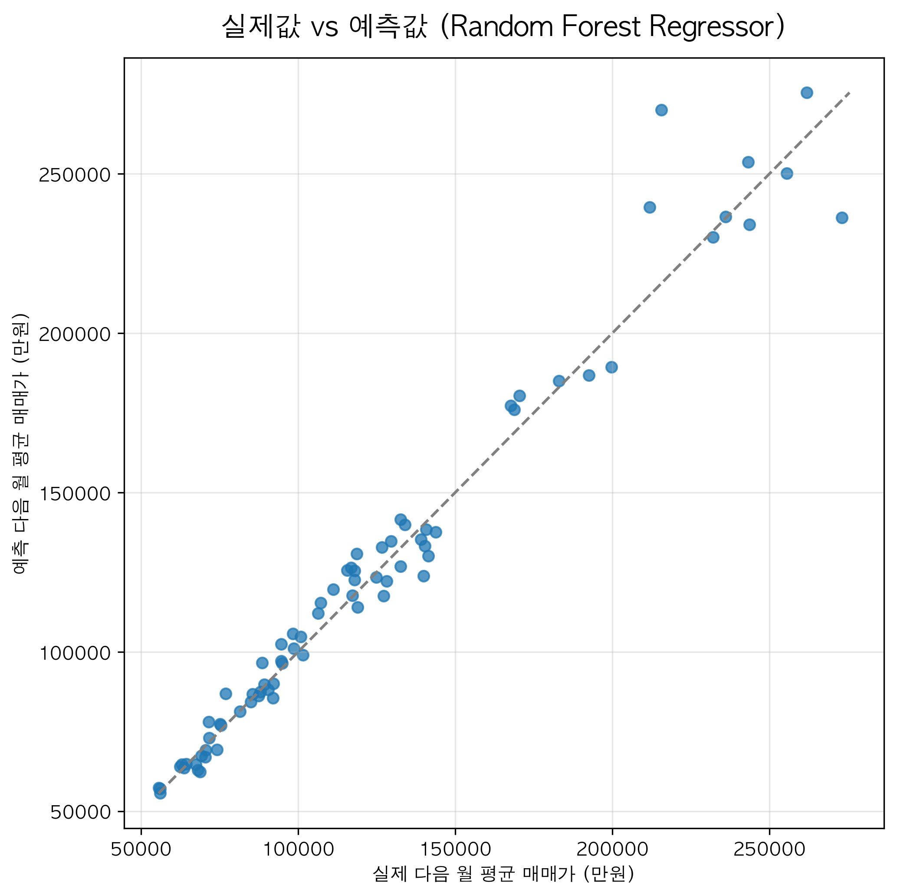
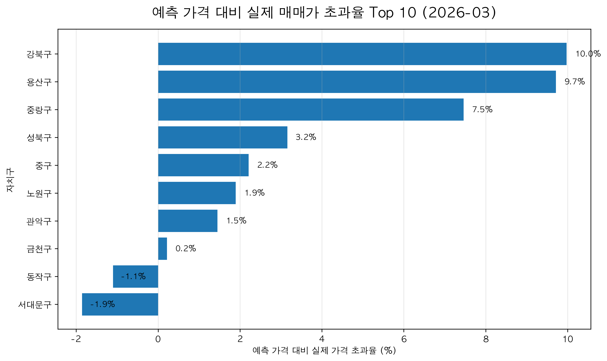
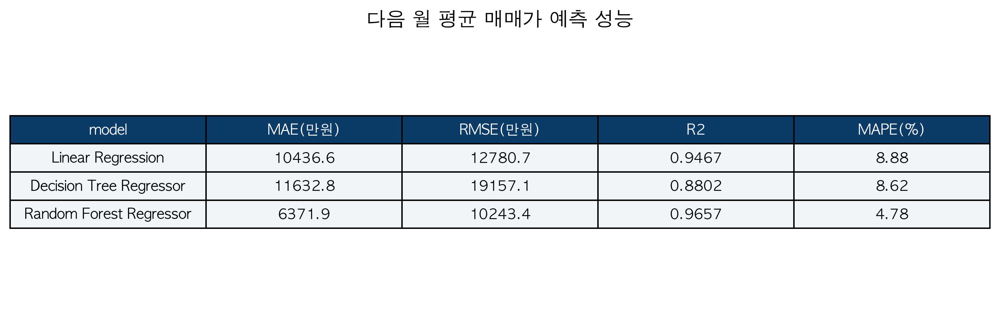
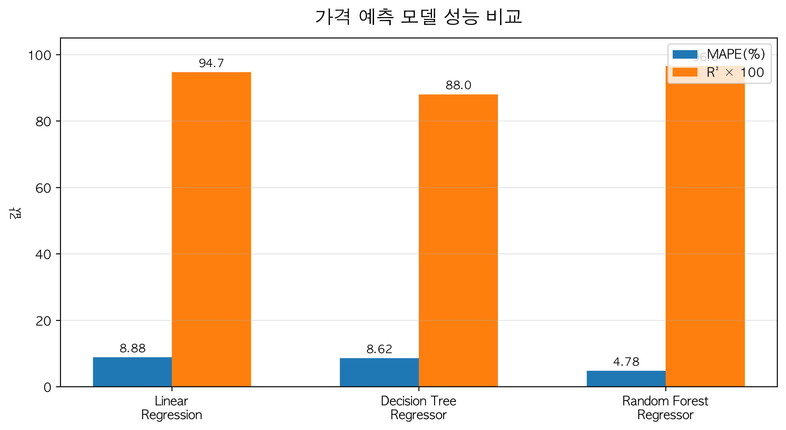
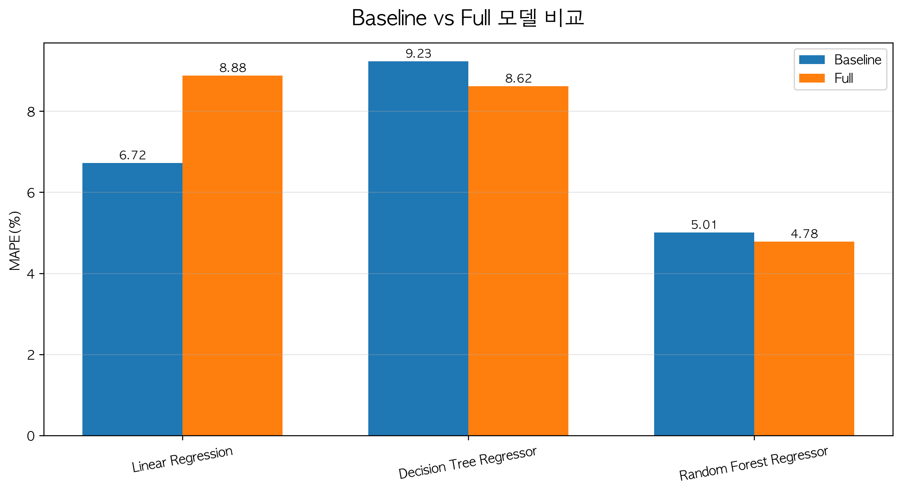
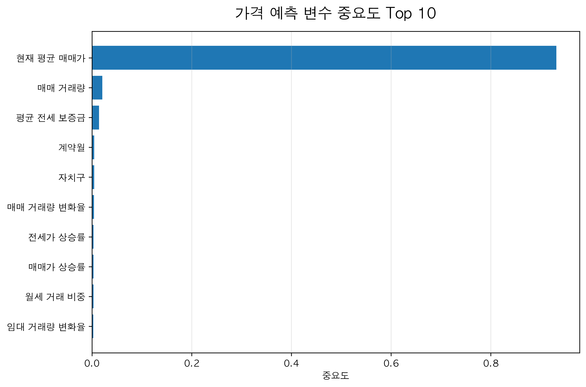

# 서울 아파트 가격 예측 및 위험 신호 해석

> **부동산 실거래 데이터를 활용한 서울 25개 자치구 월별 평균 매매가 예측 프로젝트**
> 매매-전세 괴리율, 거래량 변화, 월세화 지표를 활용하여 가격 예측에 영향을 미치는 요인을 분석하고, 예측값과 실제값의 차이를 위험 신호로 해석한다.

<br>

<p align="center">
  
  
</p>

---

## 01. 프로젝트 개요

### 프로젝트 주제

**서울 아파트 가격 예측 및 위험 신호 해석**
**매매-전세 괴리율 · 거래량 · 월세화 변수를 활용한 머신러닝 분석**

본 프로젝트는 공지 주제 중 **아파트 가격 예측**을 기반으로 한다.
부동산 실거래 데이터를 활용하여 서울 25개 자치구의 **다음 월 평균 매매가를 예측**하고, 가격 예측에 영향을 미치는 요인을 분석하였다.

단순히 현재 매매가만 사용하는 것이 아니라, 다음과 같은 시장 신호 변수를 생성하여 가격 예측에 활용하였다.

| 변수 묶음   | 사용 변수                    | 해석                           |
| ------- | ------------------------ | ---------------------------- |
| 가격 수준   | 현재 월 평균 매매가, 평균 전세 보증금   | 현재 가격 수준과 전세가 기반 가격 지지력      |
| 가격 흐름   | 매매가 상승률, 전세가 상승률, 상승률 차이 | 매매가만 빠르게 오르는 과열 여부           |
| 전세 지지력  | 전세가율, 매매-전세 괴리율          | 전세가가 매매가를 얼마나 뒷받침하는지         |
| 시장 활동성  | 거래량 변화율                  | 가격 상승 또는 정체가 실제 거래를 동반하는지    |
| 임대시장 변화 | 월세화 지표                   | 전세 중심 구조에서 월세 중심 구조로 이동하는 흐름 |

이후 예측값과 실제값의 차이를 확인하고, 실제 가격이 예측 가격보다 높게 나타나는 지역을 **우선 점검이 필요한 가격 위험 신호**로 해석하였다.
마지막으로 해당 신호를 실거주자, 투자자, 정체 구간 관점에서 구분하여 설명하였다.

---

## 02. 문제 정의

부동산 시장에서 가격이 상승한다고 해서 그 상승이 항상 안정적인 것은 아니다.
매매가가 상승하더라도 전세가와 거래량이 함께 뒷받침되지 않으면, 실거주 수요보다 기대감 중심의 상승일 가능성이 있다.

또한 가격이 정체되어 있어도 거래량이 줄고 매매-전세 괴리율이 높다면, 안정적인 정체가 아니라 **거래 위축 또는 고평가 정체**일 수 있다.

따라서 본 프로젝트는 다음 문제의식에서 출발하였다.

> **서울 아파트 가격은 전세가, 거래량, 월세화 흐름과 같은 시장 신호로 설명될 수 있는가?**
> **그리고 예측 가격보다 실제 가격이 높은 지역은 어떤 관점에서 주의해서 해석해야 하는가?**

### 연구 질문

| 번호 | 연구 질문                             |
| -- | --------------------------------- |
| Q1 | 전세가율과 매매-전세 괴리율은 가격 설명에 도움이 되는가?  |
| Q2 | 거래량 변화는 가격 위험 해석에 필요한가?           |
| Q3 | 월세화 흐름은 주거비 구조 변화를 반영하는가?         |
| Q4 | 생성 변수를 추가하면 가격 예측 성능과 설명력이 좋아지는가? |

---

## 03. 데이터 출처 및 분석 범위

| 구분     | 내용                                           |
| ------ | -------------------------------------------- |
| 데이터 출처 | 국토교통부 아파트 매매 실거래가 / 전월세 실거래가                 |
| 분석 지역  | 서울특별시 25개 자치구                                |
| 분석 기간  | 2023.05 ~ 2026.04                            |
| 분석 단위  | 자치구 × 월                                      |
| 최종 규모  | 900행, 23열                                    |
| 최종 데이터 | `monthly_merged.csv`, `modeling_dataset.csv` |

공공 실거래 데이터를 자치구와 월 단위로 통합하여 분석하였다.
가격 예측을 위해 매매가뿐 아니라 전세가, 월세, 거래량 흐름을 같은 월 단위에서 비교할 수 있도록 재구성하였다.

---

## 04. 전체 분석 흐름


본 프로젝트의 핵심 흐름은 다음과 같다.

1. 서울 25개 자치구의 월별 아파트 실거래 데이터를 수집한다.
2. 매매·전세·월세 데이터를 자치구 × 월 단위로 병합한다.
3. EDA를 통해 가격 예측에 필요한 시장 신호를 확인한다.
4. 전세가율, 괴리율, 상승률 차이, 월세화 지표, 거래량 변화율을 생성한다.
5. 생성 변수를 활용하여 다음 월 평균 매매가를 예측한다.
6. Baseline 모델과 Full 모델을 비교하여 생성 변수의 효과를 확인한다.
7. Random Forest 변수 중요도를 통해 가격 예측에 영향을 주는 요인을 분석한다.
8. 예측값과 실제값의 차이를 확인하고, 이를 관점별 위험 신호로 해석한다.

---

## 05. 프로젝트 폴더 구조

```text
RealEstate-Risk-Radar/
│
├── data/
│   ├── raw/
│   └── processed/
│       ├── monthly_merged.csv
│       └── modeling_dataset.csv
│
├── notebooks/
│   ├── 02_eda.ipynb
│   ├── 03_preprocessing.ipynb
│   ├── 04_feature_engineering.ipynb
│   ├── 05_modeling.ipynb
│   ├── 06_model_result_visualization.ipynb
│   └── 07_presentation_tables.ipynb
│
├── outputs/
│   ├── figures/
│   │   ├── eda/
│   │   ├── model/
│   │   └── presentation/
│   ├── tables/
│   └── presentation_tables/
│
├── README.md
└── 통합정리본.md
```

---

## 06. 노트북별 역할

| 노트북                                   | 역할                               | 주요 산출물                 |
| ------------------------------------- | -------------------------------- | ---------------------- |
| `03_preprocessing.ipynb`              | 원본 실거래가를 자치구 × 월 단위로 전처리         | `monthly_merged.csv`   |
| `02_eda.ipynb`                        | 가격 수준, 전세가, 월세화, 거래량 흐름 확인       | EDA 그래프                |
| `04_feature_engineering.ipynb`        | 가격 예측용 파생 변수 생성                  | `modeling_dataset.csv` |
| `05_modeling.ipynb`                   | 가격 예측 모델링, 모델 비교, 변수 중요도, 초과율 분석 | 모델 성능표, 예측 그래프         |
| `06_model_result_visualization.ipynb` | 모델 결과 파일 및 발표용 이미지 확인            | 결과 확인                  |
| `07_presentation_tables.ipynb`        | 관점별 위험 신호 보조 표 생성                | 발표용 보조 표               |

---

## 07. 데이터 전처리

전처리의 목적은 원본 실거래가 데이터를 머신러닝 모델에 사용할 수 있는 월별 집계 데이터로 변환하는 것이다.

| 전처리 단계      | 내용                                    |
| ----------- | ------------------------------------- |
| 금액 문자열 변환   | 거래금액, 보증금, 월세 금액을 수치형으로 변환            |
| 계약년월 정리     | 계약년월을 월 기준 데이터로 변환                    |
| 전세/월세 구분    | 월세 금액이 0이면 전세, 0보다 크면 월세로 구분          |
| 자치구·월 기준 병합 | 매매 데이터와 전월세 데이터를 자치구·월 단위로 병합         |
| 모델 데이터 생성   | 결측/이상값 점검 후 `modeling_dataset.csv` 생성 |

최종 분석 단위는 **서울 25개 자치구 × 월별 관측치**이다.

---

## 08. EDA: 가격 예측을 위한 시장 신호 확인

EDA는 단순히 그래프를 확인하는 과정이 아니라, 가격 예측에 사용할 시장 신호를 찾고 변수 생성 근거를 마련하는 과정이다.

### 08-1. 지역별 평균 매매가와 평균 전세 보증금

<p align="center">
  
  
</p>

| 확인 내용                         | 해석                                 |
| ----------------------------- | ---------------------------------- |
| 강남구, 서초구, 용산구의 평균 매매가가 높게 나타남 | 지역별 가격 수준 차이가 뚜렷함                  |
| 평균 전세 보증금도 일부 고가 지역에서 높게 나타남  | 전세가는 거주 수요와 가격 지지력을 참고할 수 있는 보조 신호 |
| 매매가만으로는 위험 여부 판단이 어려움         | 전세가율과 매매-전세 괴리율 생성 필요              |

---

### 08-2. 월별 매매가와 전세가 흐름

<p align="center">
  
  
</p>

| 확인 내용                    | 해석                              |
| ------------------------ | ------------------------------- |
| 월별 평균 매매가는 상승과 하락을 반복함   | 단기 가격 변동성을 반영할 필요가 있음           |
| 평균 전세 보증금은 비교적 상승 흐름을 보임 | 전세가는 실거주 수요와 가격 지지력을 해석하는 보조 신호 |
| 매매가와 전세가의 상승 속도가 다를 수 있음 | 상승률 차이 변수 생성 필요                 |

---

### 08-3. 월세화 흐름

<p align="center">
  
</p>

월세 거래 비중은 기간에 따라 변동하며, 일부 구간에서 높은 수준을 보인다.
월세화 흐름은 전세 유지 부담과 임대시장 구조 변화를 보여주는 보조 신호로 활용할 수 있다.

따라서 본 프로젝트에서는 다음 변수를 생성하였다.

```text
월세화 지표 = 월세 거래량 / 전체 임대 거래량
```

---

### 08-4. 거래량 변화

<p align="center">
  
</p>

거래량은 가격 상승 또는 정체를 해석하는 데 중요한 시장 활동성 지표이다.

| 거래량 흐름         | 해석                             |
| -------------- | ------------------------------ |
| 거래량 증가         | 시장 관심 또는 단기 수요 유입 가능성          |
| 거래량 감소         | 유동성 약화 또는 거래 위축 가능성            |
| 가격 상승 + 거래량 감소 | 가격 상승이 실제 거래로 충분히 뒷받침되지 않을 가능성 |

따라서 가격 흐름과 함께 보기 위해 전월 대비 매매 거래량 변화율을 생성하였다.

---

## 09. 변수 선택 및 생성

현실 문제를 가격 예측 변수로 변환하기 위해 다음 변수를 생성하였다.

| 현실 문제         | 확인할 신호               | 선택 변수     |
| ------------- | -------------------- | --------- |
| 단기 가격 급등      | 단기간 가격 급등            | 매매가 상승률   |
| 가격을 받쳐주는 힘 부족 | 전세가가 매매가를 얼마나 뒷받침하는지 | 전세가율      |
| 가격 고평가 가능성    | 매매가와 전세가의 차이         | 매매-전세 괴리율 |
| 매매가만 오르는 과열   | 매매 상승률 > 전세 상승률      | 상승률 차이    |
| 주거비 구조 변화     | 전세에서 월세로 이동          | 월세화 지표    |
| 거래 위축/급변      | 거래량 증감               | 거래량 변화율   |

생성 변수는 가격 예측에 투입되는 시장 신호 변수이며, 이후 위험 해석의 근거로도 활용된다.

---

## 10. 주요 생성 변수

| 변수          | 계산 방식                            | 의미          |
| ----------- | -------------------------------- | ----------- |
| 다음 월 평균 매매가 | 자치구별 `avg_sale_price`를 한 달 뒤로 이동 | 예측 타깃       |
| 전세가율        | 면적당 평균 전세가 / 면적당 평균 매매가          | 가격 지지력      |
| 매매-전세 괴리율   | 1 - 전세가율                         | 가격 부담 / 괴리  |
| 상승률 차이      | 매매가 상승률 - 전세가 상승률                | 매매가 단독 과열   |
| 월세화 지표      | 월세 거래량 / 전체 임대 거래량               | 임대시장 구조 변화  |
| 거래량 변화율     | 전월 대비 매매 거래량 변화율                 | 시장 활동성 / 위축 |

---

## 11. 모델 설계

본 프로젝트는 다음 월 평균 매매가를 예측하는 **회귀 문제**로 설정하였다.

### 11-1. 타깃 변수

| 구분    | 내용                                                            |
| ----- | ------------------------------------------------------------- |
| 타깃 변수 | 다음 월 평균 매매가                                                   |
| 생성 방식 | 자치구별 `avg_sale_price`를 한 달 뒤로 이동하여 `next_month_sale_price` 생성 |

### 11-2. 입력 변수

| 변수 유형    | 변수                                 |
| -------- | ---------------------------------- |
| 기본 가격 변수 | 현재 월 평균 매매가, 평균 전세 보증금, 매매 거래량     |
| 지역·시간 변수 | 자치구, 월, 연도                         |
| 생성 변수    | 전세가율, 괴리율, 상승률 차이, 거래량 변화율, 월세화 지표 |

### 11-3. 평가 방식

시간 흐름을 고려하여 과거 월 데이터를 학습 데이터로 사용하고, 최근 구간을 테스트 데이터로 사용하였다.

| 지표   | 의미           |
| ---- | ------------ |
| MAE  | 평균 절대 오차     |
| RMSE | 큰 오차에 민감한 지표 |
| R²   | 설명력          |
| MAPE | 백분율 오차       |

---

## 12. 사용 모델

수업에서 다룬 scikit-learn 회귀 모델을 중심으로 사용하였다.

| 모델                      | 사용 목적                   |
| ----------------------- | ----------------------- |
| Linear Regression       | 해석이 쉬운 기본 회귀 모델         |
| Decision Tree Regressor | 비선형 관계를 나무 구조로 학습       |
| Random Forest Regressor | 여러 결정 트리로 성능과 변수 중요도 확인 |

여러 회귀 모델의 예측 성능을 비교하고, Random Forest를 통해 가격 예측에 중요한 변수를 확인하였다.

---

## 13. 가격 예측 모델 성능 비교

<p align="center">
  
</p>

<p align="center">
  
</p>

가격 예측 모델 성능을 비교한 결과, Random Forest Regressor가 낮은 MAPE와 높은 설명력을 보였다.
이는 현재 가격 수준뿐 아니라 전세가, 전세가율, 괴리율, 거래량 변화, 월세화 지표와 같은 시장 신호가 다음 월 평균 매매가 예측에 활용될 수 있음을 보여준다.

---

## 14. Baseline과 Full 모델 비교

생성 변수가 가격 예측에 도움이 되는지 확인하기 위해 Baseline과 Full 모델을 비교하였다.

| 모델 구분      | 사용 변수                                            | 목적                  |
| ---------- | ------------------------------------------------ | ------------------- |
| Baseline   | 기본 가격·지역·시간 변수                                   | 기본 가격 수준과 시간 흐름만 반영 |
| Full Model | Baseline 변수 + 전세가율, 괴리율, 상승률 차이, 월세화 지표, 거래량 변화율 | 생성 변수의 추가 효과 확인     |

<p align="center">
  
</p>

생성 변수를 추가한다고 모든 모델의 성능이 항상 좋아지는 것은 아니었다.
그러나 Random Forest에서는 Full 모델의 MAPE가 낮아져, 생성 변수가 비선형 모델에서 가격 예측에 활용될 수 있음을 확인하였다.

이 결과는 본 프로젝트가 단순히 모델만 바꾼 것이 아니라, 가격을 설명하는 변수 조합의 의미를 검증했다는 점에서 중요하다.

---

## 15. 실제 매매가와 예측 매매가 비교

<p align="center">
  
</p>

실제 매매가와 예측 매매가를 비교한 결과, 대부분의 점이 대각선에 가까이 분포하여 모델이 전반적인 가격 수준을 설명할 수 있음을 확인하였다.

그래프에서 대각선 아래쪽에 위치한 점은 실제 매매가가 예측 매매가보다 높은 경우이다.
이러한 지역은 시장 신호로 설명되는 가격 수준보다 실제 가격이 높게 형성된 우선 점검 구간으로 해석할 수 있다.

---

## 16. 가격 예측 변수 중요도 분석

<p align="center">
  
</p>

Random Forest 기준 변수 중요도에서는 현재 평균 매매가가 가장 큰 기준 변수로 나타났다.
이는 한 달 뒤 가격이 현재 가격 수준을 강하게 따라가기 때문으로 해석할 수 있다.

다만 본 프로젝트는 현재 가격만으로 해석을 끝내지 않고, 전세가율, 괴리율, 거래량 변화, 월세화 지표를 함께 보조 시장 신호로 활용하였다.
따라서 변수 중요도 결과는 **현재 가격 수준이 가격 예측의 기준선이며, 생성 변수는 가격을 해석하는 보조 신호**라는 점을 보여준다.

---

## 17. 예측 가격 대비 실제 가격 초과율 분석

<p align="center">
  
</p>

예측 가격 대비 실제 가격 초과율을 계산하여, 실제 매매가가 예측 매매가보다 높은 지역을 확인하였다.

이러한 지역은 전세가, 거래량, 월세화 흐름으로 설명되는 가격보다 실제 가격이 높게 형성된 구간으로 볼 수 있다.
다만 이는 해당 지역이 반드시 위험하다는 뜻은 아니며, **우선 점검 대상**으로 해석하는 것이 적절하다.

---

## 18. 위험 신호 해석 프레임

예측값보다 실제값이 높은 구간을 세 관점으로 해석하였다.

| 관점    | 주요 신호                       | 해석                   |
| ----- | --------------------------- | -------------------- |
| 실거주자  | 전세가율 낮음, 괴리율 높음, 월세화 상승     | 매수 부담과 주거비 구조 변화 점검  |
| 투자자   | 매매 상승률 높음, 상승률 차이 큼, 거래량 급변 | 뒤늦은 고가 매수와 과열 가능성 확인 |
| 정체 구간 | 가격 정체, 거래량 감소, 고괴리율         | 안정 정체인지 거래 위축인지 구분   |

관점별 해석은 예측의 목표가 아니라, 예측 결과를 실제 의사결정 언어로 바꾸기 위한 과정이다.

---

## 19. 연구 질문에 대한 답변

### Q1. 전세가율·괴리율은 가격 설명에 도움이 되는가?

도움이 된다. 전세가율은 가격 지지력을, 괴리율은 가격 부담과 고평가 가능성을 해석하는 데 활용된다.

### Q2. 거래량 변화는 가격 위험 해석에 필요한가?

필요하다. 가격 상승이나 정체가 실제 거래를 동반하는지 판단하는 보조 신호가 된다.

### Q3. 월세화 흐름은 주거비 구조 변화를 반영하는가?

반영한다. 월세 거래 비중은 전세 유지 부담과 임대시장 구조 변화를 보여준다.

### Q4. 생성 변수를 추가하면 가격 예측 성능과 설명력이 좋아지는가?

모든 모델에서 개선된 것은 아니지만, Random Forest에서 Full 모델의 MAPE가 낮아져 생성 변수의 활용 가능성을 확인했다.

---

## 20. 결론 및 활용 방안

본 프로젝트의 결론은 다음과 같다.

1. 아파트 가격 예측에서는 매매가만 보는 것보다 전세가, 거래량, 월세화 흐름을 함께 확인해야 한다.
2. 생성 변수는 가격 예측의 입력 변수이면서, 예측 결과를 해석하는 근거가 된다.
3. 예측값보다 실제 가격이 높은 지역은 가격을 뒷받침하는 시장 신호 대비 가격이 높게 형성된 우선 점검 대상으로 볼 수 있다.
4. 같은 지역이라도 실거주자, 투자자, 정체도 관점에 따라 위험 해석은 달라질 수 있다.

---

## 21. 한계 및 향후 개선점

본 분석은 서울 25개 구의 월별 평균 데이터를 기준으로 하므로, 개별 단지 단위의 세부 판단에는 한계가 있다.

또한 금리, 대출 규제, 입주 물량, 개발 호재, 인구 이동 등 외부 요인을 반영하지 못했다.
따라서 결과는 특정 지역이 반드시 위험하다는 결론이 아니라, 추가 확인이 필요한 가격 위험 신호로 해석해야 한다.

향후에는 외부 경제 변수와 단지 단위 데이터를 추가하여 더 정교한 가격 예측 모델로 확장할 수 있다.

---

## 22. 주요 산출물

| 산출물                                       | 설명                            |
| ----------------------------------------- | ----------------------------- |
| `monthly_merged.csv`                      | EDA와 변수 생성의 기준 데이터            |
| `modeling_dataset.csv`                    | 머신러닝 모델 입력 데이터                |
| `price_prediction_comparison.csv`         | 가격 예측 모델 성능 비교                |
| `price_prediction_all_model_results.csv`  | Baseline/Full 전체 모델 성능 비교     |
| `baseline_full_mape_comparison.csv`       | Baseline과 Full 모델의 MAPE 비교    |
| `price_prediction_actual_vs_pred.png`     | 실제 매매가와 예측 매매가 비교 그래프         |
| `price_prediction_feature_importance.png` | 가격 예측 변수 중요도 그래프              |
| `price_support_gap_top10.png`             | 예측 가격 대비 실제 가격 초과율 Top 10 그래프 |

---

## 23. 실행 순서

노트북은 아래 순서대로 실행한다.

```text
03_preprocessing.ipynb
02_eda.ipynb
04_feature_engineering.ipynb
05_modeling.ipynb
06_model_result_visualization.ipynb
07_presentation_tables.ipynb
```

주요 결과 이미지는 `outputs/figures/`에 저장되며, 주요 결과 표는 `outputs/tables/`에 저장된다.

---

## 24. 최종 요약

본 프로젝트는 서울 25개 자치구의 월별 평균 매매가를 예측하고, 가격에 영향을 미치는 시장 신호를 분석하였다.

전세가율, 매매-전세 괴리율, 상승률 차이, 거래량 변화율, 월세화 지표를 생성하여 가격 예측에 활용했고, 예측값과 실제값의 차이를 실거주자·투자자·정체도 관점의 위험 신호로 해석하였다.

핵심은 단순히 모델 성능을 높이는 것이 아니라, **가격 예측에 필요한 변수 조합을 설계하고 그 결과를 현실적인 의사결정 언어로 해석하는 것**이다.

---

## 25. 참고문헌

* 김대원·조주현, 「서울시 아파트 전세가격 및 전세금비율 변동의 결정요인 분석」, 『주택연구』 제20권 제3호, 2012, 183-204쪽.
* 정대성, 「아파트 매매가격, 전세가격 및 월세가격 간의 수익률 전이효과」, 『주택금융연구』 제6권 제2호, 2022, 123-142쪽.
* 김상배, 「점진적 이동을 고려한 지역별 아파트 매매가격과 전세가격 사이의 전이 효과에 대한 연구」, 『부동산분석』 제9권 제1호, 2023, 211-228쪽.
* 전해정, 「주택가격과 거래량간의 동학적 분석 및 정책적 시사점에 관한 연구: 서울시 25개구를 중심으로」, 『정책분석평가학회보』 제22권 제4호, 2012, 127-152쪽.
* 박초롱, 「전국 월세 비중 처음 60% 넘었다…지방 빌라는 83% 수준」, 연합뉴스, 2025.04.01.
* 홍세희, 「서울 아파트 월세 평균 147만원…월세지수 '역대 최고'」, 뉴시스, 2026.01.06.
* 변명섭, 「11월 서울 아파트 거래량 60.2% 급감…토허제 착시일까」, 연합인포맥스, 2025.12.31.
* KB국민은행, 「KB주택시장 리뷰 2025년 10월호 - 전월세 거래」, KB의 생각, 2025.10.16.
* 함철민, 「이 대통령 “부동산 시장, 폭탄돌리기 하는 거 아닌가... 나라가 망할 일”」, 인사이트, 2025.10.14.
