# Housing-Risk-Radar

> 서울 25개 구 아파트 매매·전세·월세 데이터를 활용한 지역별 부동산 위험 신호 분석 프로젝트

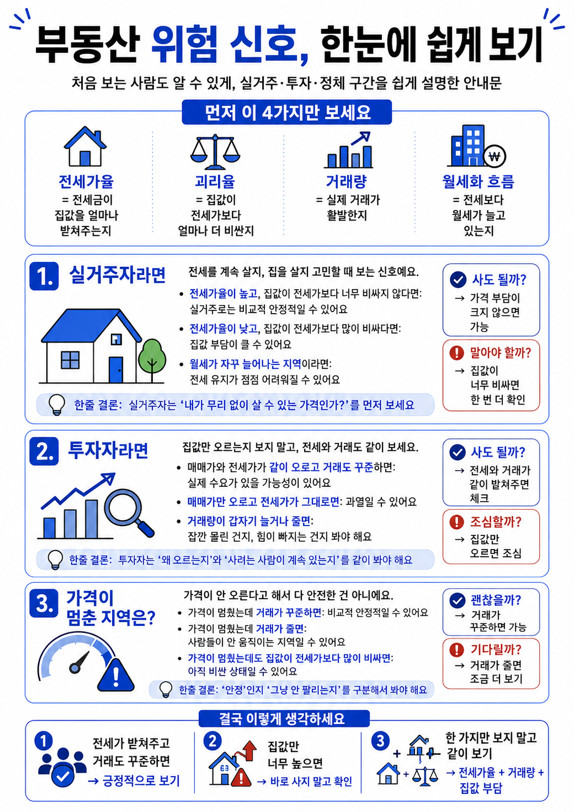

---

## 01. 프로젝트 주제

### 아파트 매매-전세 괴리율 분석을 통한 부동산 ‘폭탄돌리기’ 위험 지수 모델링

본 프로젝트는 공지 주제 중 **아파트 가격 예측**을 기반으로 하되, 단순히 아파트 가격을 예측하는 것에서 나아가 가격에 영향을 주는 요인을 분석하고 지역별 위험 신호를 판단하는 방향으로 확장했다.

서울특별시 25개 구의 월별 아파트 매매·전세·월세 데이터를 활용하여, 전세가율, 매매-전세 괴리율, 가격 상승률 차이, 거래량 변화, 월세화 흐름을 변수로 생성했다. 이후 실거주자와 투자자 관점에서 위험 지수를 설계하고, 머신러닝 모델을 통해 위험 지역 분류와 군집화를 수행했다.

---

## 02. 현실 문제와 주제 선택 이유

최근 부동산 시장에서는 매매가격만 보고 지역의 위험도를 판단하기 어렵다.

매매가격이 상승하더라도 전세가격이 함께 상승한다면 실거주 수요가 가격을 어느 정도 뒷받침한다고 볼 수 있다. 그러나 매매가격만 빠르게 오르고 전세가격이 따라오지 못하는 지역은 실거주 가치보다 투자 기대감이 과도하게 반영되었을 가능성이 있다.

또한 전세난과 월세화 흐름이 커질수록 실거주자는 전세를 유지할지, 매수를 검토할지 판단하기 어려워진다. 투자자 역시 매매가 상승률만 보고 진입할 경우, 가격 조정 시 마지막 매수자가 될 위험이 있다.

따라서 본 프로젝트는 다음 세 가지 현실 문제에서 출발했다.

| 현실 문제        | 설명                                         | 분석 방향            |
| ------------ | ------------------------------------------ | ---------------- |
| 실거주자 판단 문제   | 전세 부담이 커지는 상황에서 전세를 유지할지 매수를 검토할지 판단하기 어렵다 | 실거주 방어력 지수 설계    |
| 투자자 고점 매수 문제 | 매매가 상승만 보고 투자하면 가격 조정 시 마지막 매수자가 될 수 있다    | 마지막 매수자 위험 지수 설계 |
| 가격 정체 해석 문제  | 가격이 정체되어도 안정인지 거래 위축인지 구분하기 어렵다            | 정체도 점수 설계        |

이 문제를 해결하기 위해 본 프로젝트는 매매가와 전세가의 관계를 중심으로 지역별 위험 신호를 분석했다.

---

## 03. 핵심 부주제

본 프로젝트는 하나의 위험 점수만 제시하지 않고, 실제 의사결정 상황에 맞추어 세 가지 관점으로 나누어 분석했다.

| 부주제               | 핵심 질문               | 결과 활용 방향                              |
| ----------------- | ------------------- | ------------------------------------- |
| **실거주 방어력 지수**    | 이 지역에 실제로 거주해도 되는가? | 실거주자의 전세 유지 또는 매수 검토 판단에 활용한다         |
| **마지막 매수자 위험 지수** | 이 지역에 투자해도 되는가?     | 투자자의 고점 매수 위험과 투자 과열 가능성 판단에 활용한다     |
| **정체도 분석**        | 가격 정체는 안정인가, 위험인가?  | 가격 정체가 안정 신호인지 거래 위축 신호인지 구분하는 데 활용한다 |

---

## 04. 전체 분석 흐름

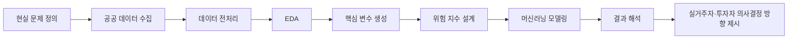

본 프로젝트의 흐름은 교수님 공지의 필수 항목인 **문제 정의, 데이터 출처, 데이터 전처리, 변수 선택 및 생성 과정, 모델 비교, 결과 해석**에 맞추어 구성했다.

---

## 05. 핵심 결과 미리보기

### 05-1. 지역별 가격 수준 차이

| 지역별 평균 매매가                                                            | 지역별 평균 전세 보증금                                                             |
| --------------------------------------------------------------------- | ------------------------------------------------------------------------- |
| 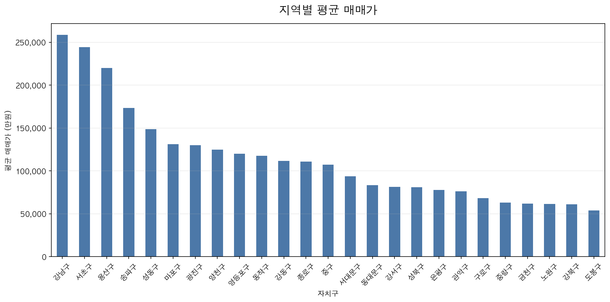 | 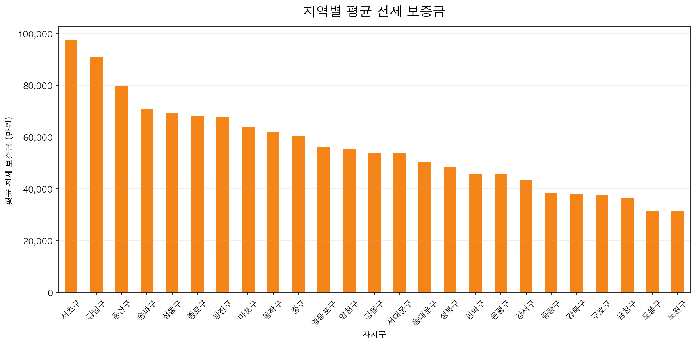 |

**결과 해석**

지역별 평균 매매가는 강남구, 서초구, 용산구 등 일부 지역에서 높게 나타났다.
평균 전세 보증금도 서초구, 강남구, 용산구 등에서 높게 나타나며, 매매가가 높은 지역은 전세 보증금도 높은 경향을 보이고 있다.

그러나 이 그래프의 핵심은 단순히 “비싼 지역”을 찾는 것이 아니다.
본 프로젝트에서는 두 가격의 관계를 활용하여 **전세가가 매매가를 얼마나 뒷받침하는지**, 그리고 **매매가와 전세가 사이의 괴리가 얼마나 큰지**를 확인했다.

따라서 이 결과를 바탕으로 <u>전세가율</u>과 <u>매매-전세 괴리율</u>을 핵심 변수로 생성했다.

---

### 05-2. 월별 가격 흐름과 전세 부담

| 월별 평균 매매가 변화                                                              | 월별 평균 전세 보증금 변화                                                               |
| ------------------------------------------------------------------------- | ----------------------------------------------------------------------------- |
| 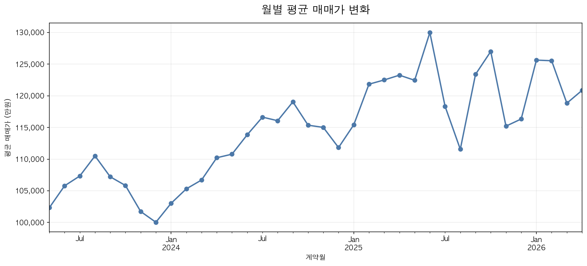 | 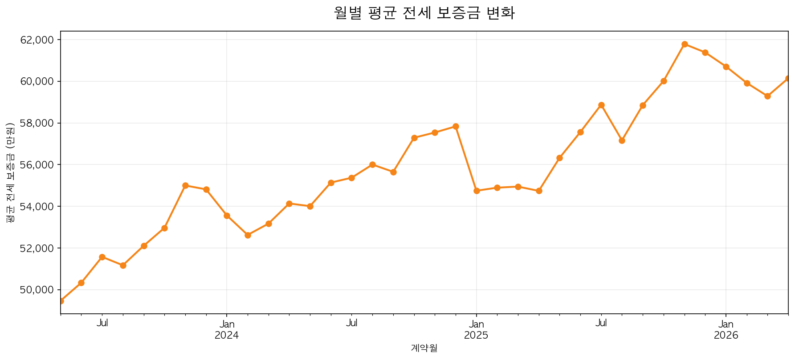 |

**결과 해석**

월별 평균 매매가는 상승과 하락을 반복하며 변동성을 보이고 있다.
월별 평균 전세 보증금은 전체적으로 상승 흐름을 보이고 있어, 실거주자 입장에서 전세 유지 부담이 커질 수 있음을 보여준다.

이 결과는 실거주자가 단순히 매매가 수준만 볼 것이 아니라, **전세 부담이 커지는 상황에서 매수 위험이 어떻게 달라지는지** 함께 판단해야 함을 보여준다.

따라서 본 프로젝트에서는 <u>매매가 상승률</u>, <u>전세가 상승률</u>, <u>상승률 차이</u>를 위험 지수에 반영했다.

---

### 05-3. 월세화 흐름

| 월별 월세 거래 비중 변화                                                            |
| ------------------------------------------------------------------------- |
| 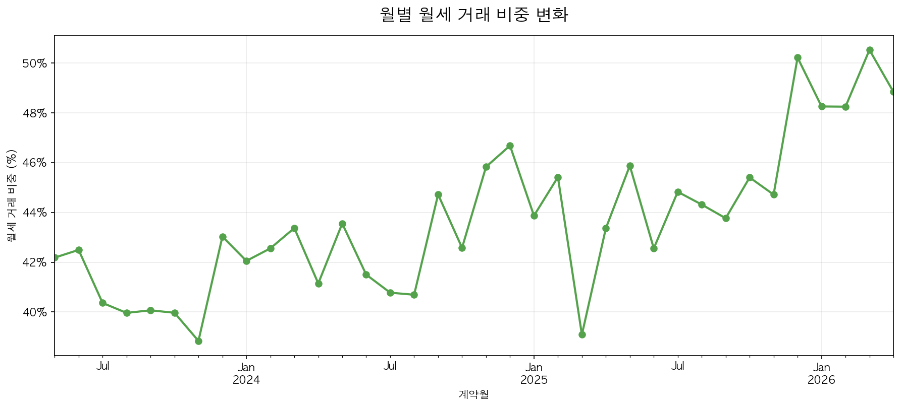 |

**결과 해석**

월별 월세 거래 비중은 기간에 따라 변동하며, 최근 구간에서 높은 수준을 보이고 있다.
이는 전세 중심의 임대시장 구조가 월세 중심으로 이동하는 흐름을 보여주는 지표로 해석할 수 있다.

월세화 흐름은 실거주자에게는 주거비 부담 구조의 변화를 의미하고, 투자자에게는 임대수익 구조의 변화를 의미한다.

따라서 본 프로젝트에서는 <u>월세 거래 비중</u>과 <u>월세화 급변 지표</u>를 위험 지수에 반영했다.

---

### 05-4. 거래량 변화

| 거래량 상위 5개 자치구의 월별 매매 거래량 변화                                                  |
| ---------------------------------------------------------------------------- |
| 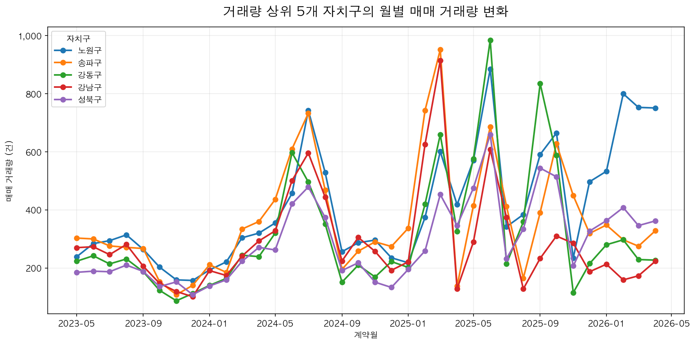 |

**결과 해석**

거래량 상위 자치구의 월별 매매 거래량은 특정 시점에 급증하거나 급감하는 모습을 보이고 있다.
거래량 급증은 단기 투자 수요 유입 또는 시장 관심 증가와 연결될 수 있고, 거래량 급감은 유동성 약화나 거래 위축 가능성과 연결될 수 있다.

따라서 거래량은 단순 보조 지표가 아니라, **투자 과열과 거래 위축 위험을 판단하는 지표**로 활용했다.

---

## 06. 데이터 구성

| 항목        | 내용                                           |
| --------- | -------------------------------------------- |
| 분석 지역     | 서울특별시 25개 구                                  |
| 분석 기간     | 2023년 5월 ~ 2026년 4월                          |
| 분석 단위     | 자치구 × 월                                      |
| 데이터 규모    | 900행, 23열                                    |
| 사용 데이터    | 아파트 매매 실거래가, 아파트 전월세 실거래가                    |
| 최종 분석 데이터 | `monthly_merged.csv`, `modeling_dataset.csv` |

원본 데이터 중 `rent_all.csv`는 용량 문제로 GitHub에 포함하지 않았다.
전처리 완료 데이터는 `data/processed/` 폴더에 정리했다.

---

## 07. 프로젝트 구조

```text
RealEstate-Risk-Radar/
│
├── README.md
│
├── data/
│   ├── raw/
│   │   └── README.md
│   └── processed/
│       ├── monthly_merged.csv
│       └── modeling_dataset.csv
│
├── notebooks/
│   ├── 02_eda.ipynb
│   ├── 03_preprocessing.ipynb
│   ├── 04_feature_engineering.ipynb
│   ├── 05_modeling.ipynb
│   └── 06_model_result_visualization.ipynb
│
├── outputs/
│   ├── figures/
│   │   ├── eda/
│   │   └── model/
│   └── tables/
│
└── docs/
    └── 부동산_위험지수_통합정리본_업그레이드.md
```

---

## 08. 파일별 역할

| 파일                                    | 역할                                  | 결과                        |
| ------------------------------------- | ----------------------------------- | ------------------------- |
| `03_preprocessing.ipynb`              | 원본 매매·전월세 데이터 전처리                   | `monthly_merged.csv` 생성   |
| `02_eda.ipynb`                        | 지역별 가격 차이, 월별 추세, 월세화 흐름 확인         | EDA 그래프 생성                |
| `04_feature_engineering.ipynb`        | 전세가율, 괴리율, 상승률 차이, 월세화 지표, 위험 지수 생성 | `modeling_dataset.csv` 생성 |
| `05_modeling.ipynb`                   | K-Means, 로지스틱 회귀, 랜덤 포레스트 적용        | 모델 성능표, 변수 중요도, 군집 요약 생성  |
| `06_model_result_visualization.ipynb` | 모델링 결과 시각화                          | 발표 및 보고서용 그래프 생성          |

---

## 09. 전처리 과정

`03_preprocessing.ipynb`

원본 매매 데이터와 전월세 데이터를 분석 가능한 형태로 변환했다.

| 처리 과정     | 설명                               |
| --------- | -------------------------------- |
| 거래금액 변환   | 쉼표가 포함된 거래금액 문자열을 숫자형으로 변환했다     |
| 보증금·월세 변환 | 전세 보증금과 월세 금액을 숫자형으로 변환했다        |
| 계약월 정리    | 계약년월을 월별 분석 기준으로 정리했다            |
| 전세·월세 구분  | 월세 금액이 0이면 전세, 0보다 크면 월세로 구분했다   |
| 지역명 정리    | 법정동 코드 기준으로 서울 25개 구 이름을 생성했다    |
| 월별 병합     | 매매 데이터와 전월세 데이터를 자치구·월 기준으로 병합했다 |

전처리 결과로 `monthly_merged.csv`를 생성했다.
이 파일은 EDA와 위험 지수 설계의 기준 데이터로 사용했다.

---

## 10. 핵심 변수 생성

`04_feature_engineering.ipynb`

현실 문제를 데이터로 분석하기 위해 다음 변수를 생성했다.

| 변수        | 계산 방식                   | 필요한 이유                            |
| --------- | ----------------------- | --------------------------------- |
| 전세가율      | 면적당 평균 전세가 / 면적당 평균 매매가 | 전세가가 매매가를 얼마나 뒷받침하는지 확인하기 위해 사용했다 |
| 매매-전세 괴리율 | 1 - 전세가율                | 매매가와 전세가의 차이가 얼마나 큰지 확인하기 위해 사용했다 |
| 상승률 차이    | 매매가 상승률 - 전세가 상승률       | 매매가만 단독으로 과열되는지 확인하기 위해 사용했다      |
| 월세화 지표    | 월세 거래량 / 전체 임대 거래량      | 전세에서 월세로 이동하는 흐름을 확인하기 위해 사용했다    |
| 월세화 급변    | 월세화 지표의 전월 대비 변화량       | 월세화 흐름이 갑자기 변하는 구간을 확인하기 위해 사용했다  |
| 거래량 변화율   | 전월 대비 매매 거래량 변화율        | 시장 유동성과 거래 위축 가능성을 확인하기 위해 사용했다   |

---

## 11. 위험 지수 설계

### 11-1. 실거주 방어력 지수

실거주자는 단기 수익보다 거주 안정성과 매수 부담이 중요하다.
따라서 실거주 방어력 지수는 **전세가율, 괴리율, 매매가 상승률, 상승률 차이, 월세화 흐름**을 반영했다.

| 반영 변수        | 해석                                         |
| ------------ | ------------------------------------------ |
| 전세가율 위험 점수   | 전세가율이 낮을수록 실거주 가치가 매매가를 충분히 받쳐주지 못한다고 해석했다 |
| 매매-전세 괴리율 점수 | 괴리율이 높을수록 실거주자의 매수 부담이 크다고 해석했다            |
| 매매가 상승률 점수   | 단기 급등 지역은 고점 매수 위험이 있다고 해석했다               |
| 상승률 차이 점수    | 매매가만 전세가보다 빠르게 오르면 투자 과열 가능성이 있다고 해석했다     |
| 월세화 점수       | 월세화 흐름은 주거비 부담 구조 변화를 보여준다고 해석했다           |

**실거주자 관점 활용 방안**

* 전세가율이 높고 괴리율이 낮은 지역은 실거주 가치가 매매가를 비교적 뒷받침한다고 볼 수 있다.
* 전세가율이 낮고 괴리율이 높은 지역은 실거주 가치보다 매매가가 높게 형성되었을 가능성이 있어 신중한 검토가 필요하다.
* 월세화 지표가 높거나 급변하는 지역은 주거비 부담 구조 변화에 대한 추가 확인이 필요하다.

---

### 11-2. 마지막 매수자 위험 지수

투자자는 매매가 상승 가능성을 보지만, 매매가 상승이 실수요를 동반하지 않으면 가격 조정 시 손실 위험이 커질 수 있다.
따라서 마지막 매수자 위험 지수는 **매매가 상승률, 상승률 차이, 괴리율, 거래량 변화, 월세화 급변**을 반영했다.

| 반영 변수        | 해석                                  |
| ------------ | ----------------------------------- |
| 매매-전세 괴리율 점수 | 가격 거품 가능성을 보여주는 핵심 변수로 해석했다         |
| 전세가율 위험 점수   | 전세가가 매매가를 받쳐주는 정도를 보여준다고 해석했다       |
| 매매가 상승률 점수   | 투자 수익 가능성과 가격 과열 가능성을 함께 보여준다고 해석했다 |
| 상승률 차이 점수    | 실수요 없이 매매가만 상승하는 구간을 확인했다           |
| 매매 거래량 변화 점수 | 단기 투자 수요 유입 또는 거래 위축을 확인했다          |

**투자자 관점 활용 방안**

* 매매가와 전세가가 함께 상승하고 거래량이 유지되는 지역은 실수요가 동반된 상승일 가능성이 있다.
* 매매가는 상승하지만 전세가가 정체되고 괴리율이 커지는 지역은 투자 과열 가능성이 있다.
* 거래량이 급증한 뒤 급감하는 지역은 유동성 약화 가능성을 점검할 필요가 있다.

---

### 11-3. 정체도 분석

가격 정체는 무조건 안정 신호라고 볼 수 없다.
가격은 정체되어도 거래량이 감소하면 거래 위축 구간일 수 있고, 괴리율이 높은 상태로 정체되면 고평가가 해소되지 않은 위험 구간일 수 있다.

정체도 점수는 다음 변수를 반영했다.

| 반영 변수     | 해석                       |
| --------- | ------------------------ |
| 매매가 정체 여부 | 매매가 상승률이 0에 가까운지 확인했다    |
| 전세가 정체 여부 | 전세가 상승률도 함께 정체되는지 확인했다   |
| 거래량 감소 여부 | 가격 정체가 안정인지 거래 위축인지 구분했다 |
| 고괴리율 여부   | 고평가 상태가 유지되는지 확인했다       |
| 월세화 급변 여부 | 임대시장 구조 변화가 동반되는지 확인했다   |

**정체도 관점 활용 방안**

* 가격 정체와 거래량 유지가 함께 나타나면 안정 정체로 해석할 수 있다.
* 가격 정체와 거래량 감소가 함께 나타나면 거래 위축 정체로 해석할 수 있다.
* 가격 정체 상태에서 괴리율이 높으면 고평가가 해소되지 않은 위험 구간으로 볼 수 있다.

---

## 12. 머신러닝 모델 적용

`05_modeling.ipynb`

| 모델                  | 사용 목적             | 해석                                |
| ------------------- | ----------------- | --------------------------------- |
| K-Means             | 위험 유형 군집화         | 지역·월 데이터를 비슷한 위험 특성을 가진 그룹으로 나누었다 |
| Logistic Regression | 위험 지역 분류          | 위험 지역과 일반 지역을 구분했다                |
| Random Forest       | 위험 지역 분류 및 변수 중요도 | 분류 성능을 비교하고 위험 판단에 중요한 변수를 확인했다   |

모델링에는 `modeling_dataset.csv`를 사용했다.
데이터 표준화 후 K-Means 군집화를 적용하고, 로지스틱 회귀와 랜덤 포레스트 모델을 비교했다.

---

## 13. 모델 성능 비교

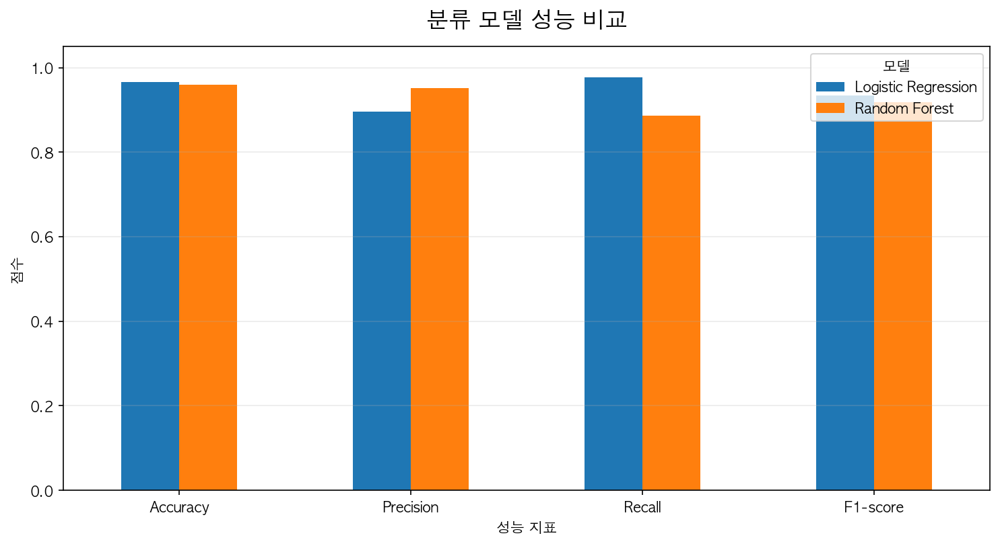

로지스틱 회귀와 랜덤 포레스트 모델의 Accuracy, Precision, Recall, F1-Score를 비교했다.
두 모델 모두 높은 분류 성능을 보였으며, 위험 지역과 일반 지역을 구분하는 데 활용 가능하다고 판단했다.

다만 성능 수치가 높게 나타난 이유는 `risk_target`이 직접 설계한 위험 지수 기준으로 만들어진 라벨이기 때문이다.
따라서 이 결과는 실제 미래 가격을 예측했다기보다, **설계한 위험 지수 기준을 모델이 얼마나 잘 분류하는지 확인한 결과**로 해석했다.

---

## 14. 변수 중요도 분석

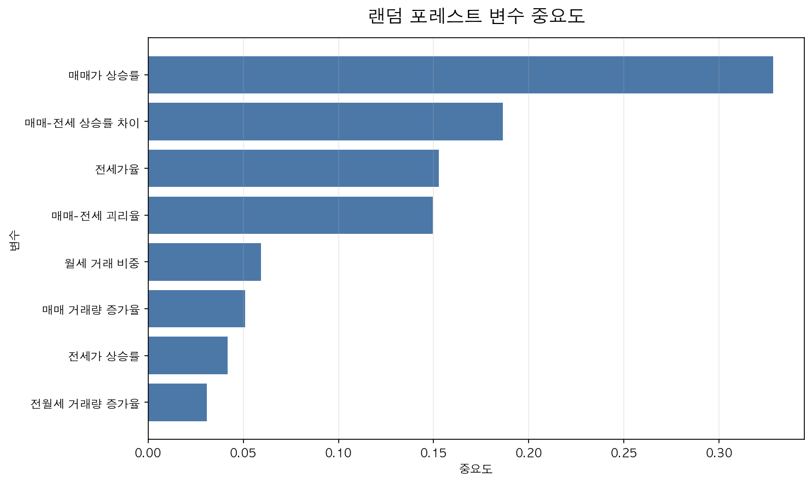

랜덤 포레스트 변수 중요도 분석 결과, **매매가 상승률**이 가장 중요한 변수로 나타났다.
그다음으로 **매매-전세 상승률 차이, 전세가율, 매매-전세 괴리율, 월세 거래 비중**이 주요 변수로 나타났다.

이 결과는 위험 판단에서 단순 가격 수준보다 **가격 상승 흐름, 전세가 지지력, 매매-전세 괴리, 월세화 흐름**이 중요하다는 점을 보여준다.

---

## 15. K-Means 군집화 결과

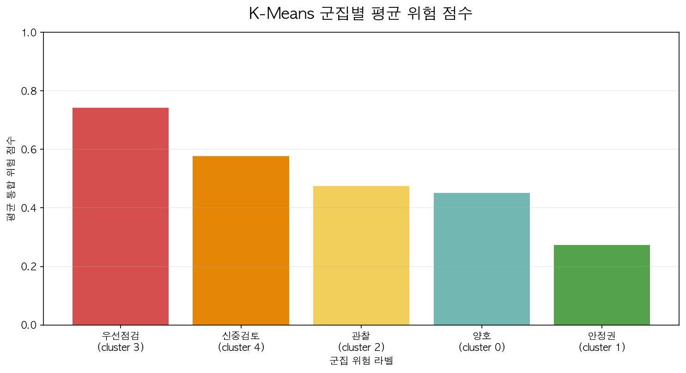

K-Means 군집화 결과, 지역·월 데이터가 평균 위험 점수에 따라 여러 군집으로 나뉘었다.
군집별 평균 위험 점수가 높은 군집은 우선점검 구간으로 해석했고, 낮은 군집은 상대적으로 안정적인 구간으로 해석했다.

이 결과는 특정 지역을 단일 위험 등급으로만 보는 것이 아니라, **시점별 위험 특성에 따라 유형화할 수 있음**을 보여준다.

---

## 16. 최신 월 기준 위험 결과

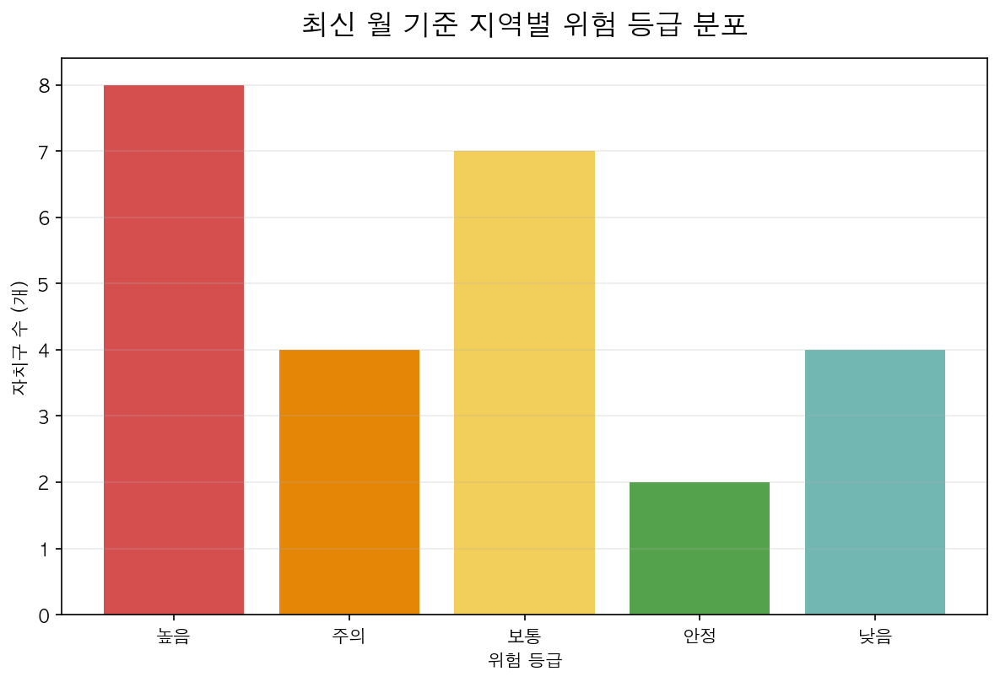

최신 월 기준으로 서울 25개 구의 위험 등급 분포를 확인했다.
위험 등급이 높은 지역과 낮은 지역이 함께 나타나며, 같은 서울 내에서도 지역별 위험 신호가 다르게 나타났다.

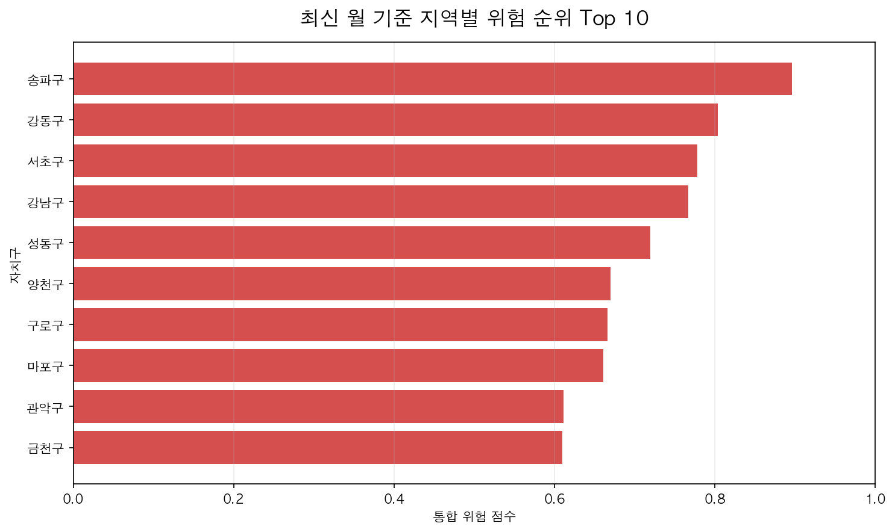

최신 월 기준 종합 위험 점수가 높은 상위 10개 자치구를 확인했다.
이 결과는 특정 지역을 무조건 위험하다고 단정하기 위한 것이 아니라, **실거주자와 투자자가 추가로 점검해야 할 지역을 선별하는 참고 지표**로 활용했다.

---

## 17. 실행 순서

아래 순서대로 실행하면 전체 분석 흐름을 재현할 수 있다.

```text
1. notebooks/03_preprocessing.ipynb
2. notebooks/02_eda.ipynb
3. notebooks/04_feature_engineering.ipynb
4. notebooks/05_modeling.ipynb
5. notebooks/06_model_result_visualization.ipynb
```

단, 원본 데이터 중 rent_all.csv는 용량이 너무 커 GitHub에 포함하지 않으므로 `03_preprocessing.ipynb`를 실행하려면 아래 파일을 `data/raw/` 폴더에 배치해야 한다.

```text
data/raw/rent_all.csv
```

rent_all.csv 다운로드 구글 드라이브 링크
https://drive.google.com/drive/folders/1tuk-z6aW0d0B7AjwCnIzC-e8k4x7Lvfa?usp=drive_link

이미 전처리된 결과를 기준으로 실행하는 경우에는 아래 파일을 사용할 수 있다.

```text
data/processed/monthly_merged.csv
data/processed/modeling_dataset.csv
```

---

## 18. 팀원 역할

| 구분           | 담당 내용                                     |
| ------------ | ----------------------------------------- |
| 김예민(팀장), 성정헌 | 데이터 수집, EDA, 그래프 제작, 모델 결과 시각화, 발표자료 작성   |
| 김지원, 양재웅     | 데이터 전처리, 변수 생성, 위험 지수 설계, 머신러닝 모델링, 결과 해석 |

---

## 19. 종합 해석

본 프로젝트의 주요 결과는 다음과 같다.

1. 서울 25개 구는 매매가와 전세 보증금 수준에서 뚜렷한 지역 차이를 보이고 있다.
2. 전세 보증금 상승 흐름과 월세 거래 비중 변화가 확인되어 실거주자의 주거비 부담 구조를 함께 고려할 필요가 있다.
3. 위험 판단에는 매매가 상승률, 매매-전세 상승률 차이, 전세가율, 괴리율, 월세 거래 비중이 중요하게 작용했다.
4. K-Means 군집화를 통해 지역·월 데이터를 위험 특성별로 구분할 수 있었다.
5. 최신 월 기준 위험 순위를 통해 우선적으로 점검해야 할 지역을 확인할 수 있었다.

---

## 20. 현실 문제에 대한 활용 방안

### 실거주자 관점

실거주자는 위험 지수를 통해 전세 유지와 매수 검토 사이에서 참고할 수 있는 지역별 신호를 확인할 수 있다.

* 전세가율이 높고 괴리율이 낮은 지역은 실거주 가치가 상대적으로 가격을 받쳐주는 지역으로 볼 수 있다.
* 전세가율이 낮고 괴리율이 높은 지역은 매수 부담이 크므로 추가 확인이 필요하다.
* 월세화 흐름이 강한 지역은 전세 유지 부담과 주거비 구조 변화를 함께 점검해야 한다.

### 투자자 관점

투자자는 매매가 상승률만 보는 것이 아니라, 전세가율과 거래량 변화를 함께 확인할 수 있다.

* 매매가와 전세가가 함께 상승하고 거래량이 유지되는 지역은 실수요 동반 가능성을 검토할 수 있다.
* 매매가만 상승하고 전세가가 정체되는 지역은 투자 과열 가능성을 점검해야 한다.
* 거래량이 급변하는 지역은 단기 수요 유입 또는 유동성 약화 가능성을 함께 고려해야 한다.

### 정체 구간 관점

정체 구간은 안정으로만 해석하지 않고 거래량과 괴리율을 함께 확인해야 한다.

* 가격 정체와 거래량 유지가 함께 나타나면 안정 정체로 볼 수 있다.
* 가격 정체와 거래량 감소가 함께 나타나면 거래 위축 정체로 볼 수 있다.
* 가격 정체 상태에서 괴리율이 높으면 고평가가 유지되는 위험 구간으로 해석할 수 있다.

---

## 21. 한계 및 향후 개선점

본 프로젝트는 매매·전세·월세 실거래 데이터를 기반으로 지역별 위험 신호를 분석했다는 점에서 의미가 있다.
다만 금리, 대출 규제, 개발 호재, 입주 물량, 지역별 소득 수준, 인구 이동 등 외부 요인은 반영하지 못했다.

향후에는 외부 경제 변수와 지역 정보를 추가하여 더 정교한 위험 판단 모델로 확장할 수 있다.

---

## 22. 참고문헌

* 김대원·조주현, 「서울시 아파트 전세가격 및 전세금비율 변동의 결정요인 분석」, 『주택연구』 제20권 제3호, 2012, 183-204쪽.

* 정대성, 「아파트 매매가격, 전세가격 및 월세가격 간의 수익률 전이효과」, 『주택금융연구』 제6권 제2호, 2022, 123-142쪽.

* 김상배, 「점진적 이동을 고려한 지역별 아파트 매매가격과 전세가격 사이의 전이 효과에 대한 연구」, 『부동산분석』 제9권 제1호, 2023, 211-228쪽.

* 전해정, 「주택가격과 거래량간의 동학적 분석 및 정책적 시사점에 관한 연구: 서울시 25개구를 중심으로」, 『정책분석평가학회보』 제22권 제4호, 2012, 127-152쪽.

* 박초롱, 「전국 월세 비중 처음 60% 넘었다…지방 빌라는 83% 수준」, 연합뉴스, 2025.04.01.
URL(접속일자: 2026.05.21)
https://www.yna.co.kr/view/AKR20250331117800003

* 홍세희, 「서울 아파트 월세 평균 147만원…월세지수 '역대 최고'」, 뉴시스, 2026.01.06.
URL(접속일자: 2026.05.21)
https://www.newsis.com/view/NISX20260105_0003465394

* 변명섭, 「11월 서울 아파트 거래량 60.2% 급감…토허제 착시일까」, 연합인포맥스, 2025.12.31.
URL(접속일자: 2026.05.21)
https://news.einfomax.co.kr/news/articleView.html?idxno=4391284

* KB국민은행, 「KB주택시장 리뷰 2025년 10월호 - 전월세 거래」, KB의 생각, 2025.10.16, (접속일자 2026.05.21), URL
https://kbthink.com/realestate/insights/research/251016-5.html
